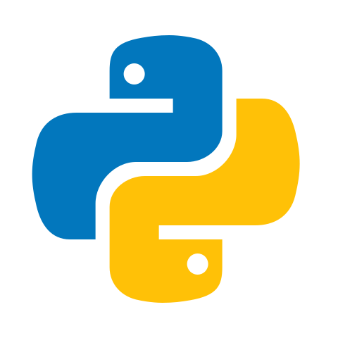

# Hi there 👋 I'm Vekshan!

I’m a 4th Year Undergraduate Studying Computer Science and Data Science at uOttawa. I have Professional Experience working as a Software Developer but my interests include AIOps, Data Engineering, Software Development, Machine Learning Engineering and MLOps.

## Programming Languages:

## Tools:

### :technologist: I'm currently working on:

-

### :nerd_face: I'm currently learning:

-

### :thinking: I want to learn:

-

### Outside of coding I enjoy:

-
